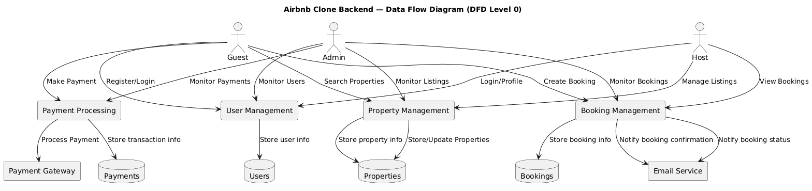
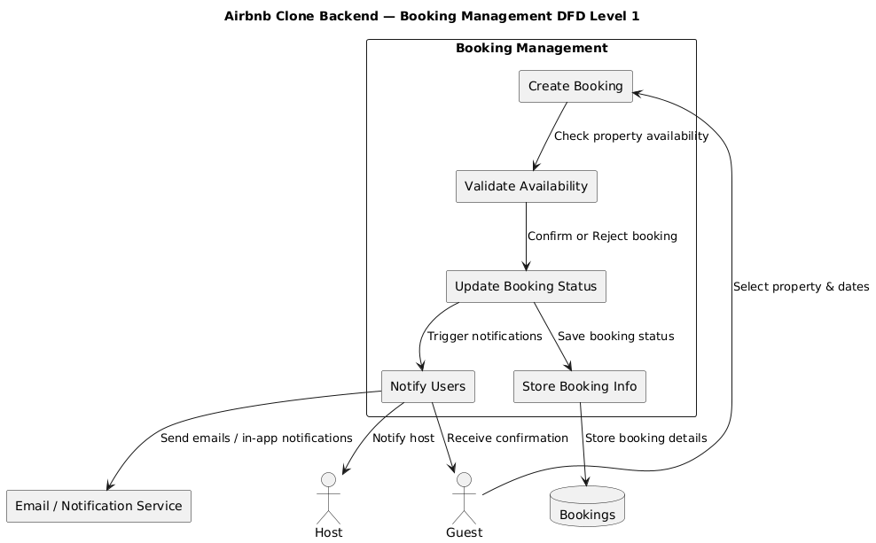

# 🏡 Airbnb Clone Backend — Data Flow Diagram

## 📘 Overview
This Data Flow Diagram (DFD) visualizes how data moves within the Airbnb Clone backend.  
It highlights interactions between **users, system processes, data stores, and external services**.

---

## 👥 Actors
- **Guest:** Creates bookings and makes payments.
- **Host:** Manages property listings and views bookings.
- **Admin:** Monitors users, bookings, properties, and payments.

---

## ⚙️ Processes
- User Management
- Property Management
- Booking Management
- Payment Processing

---

## 💾 Data Stores
- Users
- Properties
- Bookings
- Payments

---

## 🌐 External Services
- Payment Gateway
- Email Service

---

## 🖼️ Diagram


---

## 📁 Directory Structure

```
data-flow-diagram/
├── data-flow.png
└── data-flow.puml
```
---

# 📊 Booking Management — DFD Level 1

## 📘 Overview
This Level 1 DFD breaks down the **Booking Management** process in the Airbnb Clone backend.  
It shows how booking creation, validation, status updates, notifications, and storage interact.

---

## 👥 Actors
- **Guest:** Initiates bookings.
- **Host:** Receives booking notifications.

---

## ⚙️ Sub-Processes
1. Create Booking
2. Validate Availability
3. Update Booking Status
4. Notify Users
5. Store Booking Info

---

## 💾 Data Stores
- Bookings

---

## 🌐 External Services
- Email / Notification Service

---

## 🖼️ Diagram


---

## 📁 Directory Structure
```Copy code
data-flow-diagram/
├── booking-dfd-level1.png
└── booking-dfd-level1.puml
```
