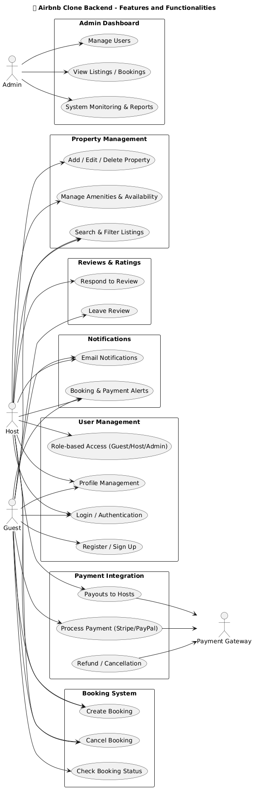

# 🌍 Airbnb Clone Backend — Features and Functionalities

## 📘 Overview
This document outlines the **core backend features and functionalities** required to build the Airbnb Clone. The backend will handle data management, authentication, API endpoints, and business logic to support the frontend and mobile clients.

---

## 🔑 Core Functionalities

### 1. User Management
- **User Registration:** Users can sign up as Guests or Hosts.
- **Authentication:** Login via email/password and OAuth (Google/Facebook).
- **Profile Management:** Update personal details, profile photos, and preferences.
- **Role-based Access:** Assign roles (Guest, Host, Admin) to control permissions.

### 2. Property Listings Management
- **Add Listings:** Hosts can create listings with title, description, price, amenities, and availability.
- **Edit/Delete Listings:** Hosts can update or remove their listings.
- **Search & Filter:** Guests can search properties by:
  - Location  
  - Price range  
  - Number of guests  
  - Amenities (Wi-Fi, pool, pet-friendly)
- **Pagination:** Display search results efficiently.

### 3. Booking Management
- **Create Booking:** Guests can book available properties for specific dates.
- **Prevent Double Booking:** Validate date availability.
- **Cancel Booking:** Guests/Hosts can cancel bookings per policy.
- **Booking Status:** Track statuses (pending, confirmed, completed, canceled).

### 4. Payment Integration
- **Secure Payments:** Integrate with Stripe or PayPal.
- **Automatic Payouts:** Transfer payments to hosts after stay completion.
- **Multi-Currency Support:** Handle various currencies.
- **Refunds:** Process cancellations and refunds automatically.

### 5. Reviews and Ratings
- Guests can rate and review properties after their stay.
- Hosts can respond to reviews.
- Reviews are tied to completed bookings.

### 6. Notification System
- Send **email and in-app notifications** for:
  - Booking confirmation
  - Cancellations
  - Payment updates

### 7. Admin Dashboard
- Admins can view and manage:
  - Users
  - Properties
  - Bookings
  - Payments
  - Reports and system logs

---

## 🛠️ Technical Requirements

| Category | Details |
|-----------|----------|
| **Database** | PostgreSQL or MySQL with tables: Users, Properties, Bookings, Payments, Reviews |
| **API Design** | RESTful API with standard HTTP methods (`GET`, `POST`, `PUT`, `DELETE`) |
| **Authentication** | JWT for session management and RBAC for access control |
| **File Storage** | Use AWS S3 or Cloudinary for property images and profile photos |
| **Email Service** | SendGrid or Mailgun for notification emails |
| **Error Handling** | Global error handler for all endpoints, proper HTTP status codes |

---

## 🚀 Non-Functional Requirements
- **Scalability:** Modular architecture with load balancer support.
- **Security:** Encrypt sensitive data, enforce HTTPS, rate limiting.
- **Performance:** Use caching (Redis) and optimized DB queries.
- **Testing:** Include unit and integration tests.
- **Documentation:** All APIs documented with OpenAPI/Swagger.

---

## 🧭 Visual Representation
Below is a high-level diagram of the system’s core modules and their relationships.

---

## 🧩 Summary
The Airbnb Clone backend provides a scalable, secure, and extensible foundation for managing users, listings, bookings, and payments. This documentation serves as a guide for developers and stakeholders to understand the system’s functional scope before implementation.
