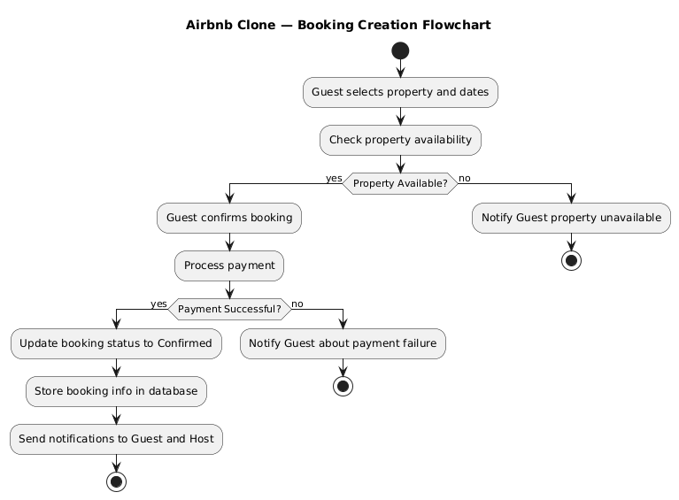

# 📊 Booking Creation Flowchart

## 📘 Overview
This flowchart visualizes the **Booking Creation process** in the Airbnb Clone backend.  
It shows how a guest selects a property, checks availability, processes payment, and confirms booking.

---

## ⚙️ Steps
1. Guest selects property and dates
2. Check property availability
3. Guest confirms booking
4. Process payment
5. Update booking status to Confirmed
6. Store booking info in database
7. Send notifications to guest and host

---

## 🖼️ Diagram


---

## 📁 Directory Structure
```
flowcharts/
├── flowchart-booking.png
└── flowchart-booking.puml
```