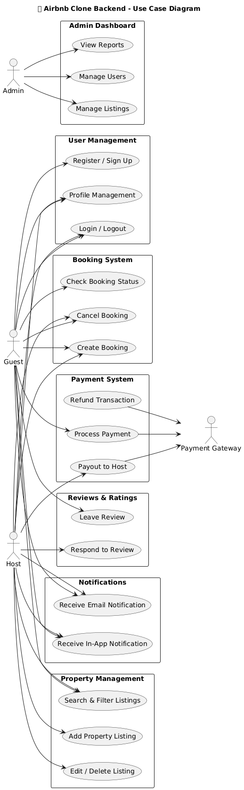

# 🏡 Airbnb Clone Backend — Use Case Diagram

## 📘 Overview
This use case diagram illustrates how different actors interact with the Airbnb Clone backend system.  
It visually represents the main functionalities and their relationships with users, administrators, and external services.  
The diagram helps to identify **who does what** in the system — an essential step in understanding backend feature requirements before development.

---

## 👥 Actors
- **Guest:** A user who can browse listings, book properties, make payments, and leave reviews.
- **Host:** A property owner who can manage listings, handle bookings, and receive payments.
- **Admin:** An administrator responsible for monitoring users, listings, and reports through the admin dashboard.
- **Payment Gateway:** An external service used for processing guest payments and host payouts.

---

## ⚙️ Core Use Cases
| Module | Description |
|---------|-------------|
| **User Management** | Register, log in, and manage profiles. |
| **Property Management** | Add, edit, delete, and search property listings. |
| **Booking System** | Create, cancel, and track bookings. |
| **Payment System** | Handle secure payments, refunds, and payouts. |
| **Reviews & Ratings** | Allow guests to leave reviews and hosts to respond. |
| **Notifications** | Send booking and payment updates via email or app alerts. |
| **Admin Dashboard** | Enable admins to manage users, listings, and generate reports. |

---

## 🧠 Purpose of the Diagram
The use case diagram provides:
- A **high-level view** of how users interact with the backend system.
- Insight into **system boundaries** and **user goals**.
- A reference point for writing **user stories** in the next task.

---

## 🖼️ Diagram
Below is the use case diagram that captures all key interactions:



---

## 🧱 Directory Structure
```yaml
Copy code
use-case-diagram/
├── use-case-diagram.png
└── README.md
```

---

## ✅ Summary
This diagram ensures a clear understanding of backend interactions and feature distribution.  
It serves as a foundation for:
- Task 2 (User Stories)
- Task 3 (Data Flow Diagram)
- Task 5 (Requirement Specifications)